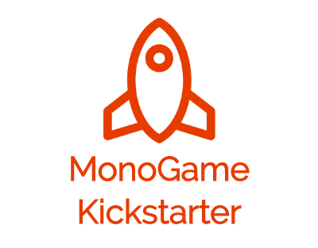

# MonoGame Kickstarter

A bash script that sets up a MonoGame solution ready for cross-platform development.

## Attention

**The script is currently not tested very much due to lack of time, so keep that in mind and run the script only if you checked it yourself first!**

## Usage

`monogame-kickstarter.sh [solutionname]`

## Works with Linux and Windows

A quick test revealed that the script can also be used with Windows in git bash!

## Demo Linux

https://youtu.be/a4lmUq_F0fM

## Demo Windows

https://youtu.be/qgvVs06UvW8

## Additional Info

The parameter `[solutionname]` is optional. If the script is started without a parameter it will use the default value which is set to "MonoGameKickstarter". If you want to make the parameter mandatory you can achieve this by editing the script and setting the variable holding the default value to an empty string e.g. `solutionname=""`. You can also define a parent folder structure where the solution folder will be put in e.g. `outputdir="monogame-kickstarter"`. The script will then create the outputdir first and put everything inside it.

## Dependencies

The script makes use of the **.NET Core SDK** and the official **MonoGame templates** which have to be installed first. For details on how to do this please check the official MonoGame documentation https://docs.monogame.net/.

## What it does

The aim of the script is to provide a convenient (quick) way to set up a new solution which can be used as a basis for new MonoGame projects. As a starting point it creates a solution containing a **MonoGame NetStandard Library** project and a **MonoGame Cross-Platform Desktop Application (OpenGL)** project as a starting point for development. Later it should be possible to add more MonoGame projects from the official MonoGame templates to the solution.

Note: The script deletes `Game1.cs` and `Content` generated by the **MonoGame Cross-Platform Desktop Application (OpenGL)** template and then sets up a link to the Content project (Content.mgcb) generated by the **MonoGame NetStandard Library** template. The idea is that the **MonoGame Cross-Platform Desktop Application (OpenGL)** should use both the shared code of the **MonoGame NetStandard Library** as well as the content of the **MonoGame NetStandard Library** project.

## [OPTIONAL] Install globally

If you like, you can define a symbolic link so that the script can be used without typing its full path from anywhere. In the following command replace `<MonoGame.Kickstarter>` with the actual path to MonoGame.Kickstarter on your system!

`sudo ln -s <MonoGame.Kickstarter>/monogame-kickstarter.sh /usr/bin/monogame-kickstarter`

e.g. if you cloned this repo to `$HOME/dev/monogame/projects` the command would be

`sudo ln -s $HOME/dev/monogame/projects/MonoGame.Kickstarter/monogame-kickstarter.sh /usr/bin/monogame-kickstarter`

## Templates

| Templates                                              | Short Name    | Language | Tags     |
|--------------------------------------------------------|---------------|----------|----------|
| MonoGame Android Application                           | mgandroid     | [C#]     | MonoGame |
| MonoGame Cross-Platform Desktop Application (OpenGL)   | mgdesktopgl   | [C#]     | MonoGame |
| MonoGame iPhone/iPad Application                       | mgios         | [C#]     | MonoGame |
| MonoGame Windows Universal Application (CoreApp)       | mguwpcore     | [C#]     | MonoGame |
| MonoGame Windows Universal Application (XAML)          | mguwpxaml     | [C#]     | MonoGame |
| MonoGame Windows Desktop Application (Windows DirectX) | mgwindowsdx   | [C#]     | MonoGame |
| MonoGame NetStandard Library                           | mgnetstandard | [C#]     | MonoGame |
| MonoGame Pipeline Extension                            | mgpipeline    | [C#]     | MonoGame |
| MonoGame Shared Library Project                        | mgshared      | [C#]     | MonoGame |
